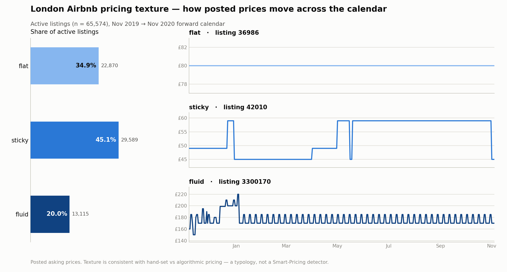
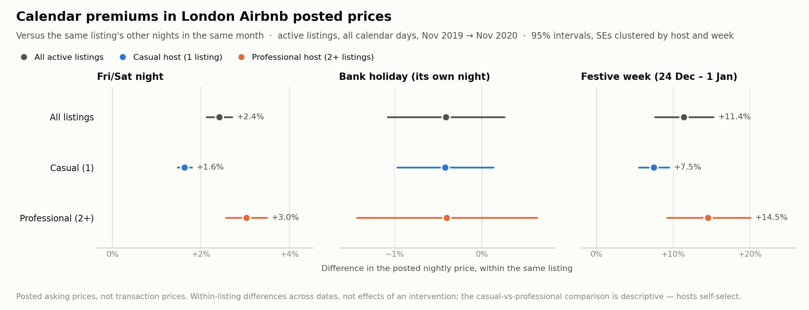

# How do London Airbnb posted prices behave over the calendar?

A study of the **posted nightly prices** that 85,068 London Airbnb listings showed for each date of
the year ahead, from the Inside Airbnb snapshot scraped on 5–6 November 2019: 31 million
listing-days of prices and availability. Every reported number is read from the data or derived
from it by a printed rule; no result rests on an assumed, unobserved parameter.

> **Posted prices, not transactions.** Every price here is an asking price: the host's (or a
> pricing tool's) stated intention as of November 2019. This is a study of how hosts *set*
> prices. It makes no claims about demand, bookings, occupancy or revenue — and the calendar's
> availability flag cannot tell a booked night from a blocked one.

## Key findings

- **About a third of active listings post the same price on every date** (34.9%, "flat"). The
  most dynamic fifth ("fluid") use fewer round-number prices, carry a weekend premium and had
  their calendars updated more recently (48% on the scrape day, vs 7% of flat listings). Fluid
  pricing is **2.4 times as common among professional hosts' listings** as among casual hosts'
  (26.8% vs 11.2%). — *derived (rule-based); the host comparison is associational*
- **Most of that professional gap remains after controlling for the recorded traits.** With room
  type, size, borough, years on Airbnb and superhost status held equal, professional hosts'
  listings are still **13.1 points more likely to vary their prices at all** (17.2 before). The
  gap is largest among big operators. Listing traits explain little of pricing style, and listings
  of the same host tend to price alike. — *associational*
- **Within the same listing, posted prices are 2.4% higher on Friday and Saturday nights**
  (95% CI 2.1–2.7%) **and 11.4% higher in the festive week, 24 Dec – 1 Jan** (7.6–15.2%), than
  on the listing's other nights of the same month. — *within-listing difference*
- **No detectable extra premium on bank holidays.** Beyond the weekend and festive-week effects,
  the holiday night is −0.4% (CI −1.1 to +0.3) and the extra night of a long weekend +0.1% (CI
  −0.1 to +0.3). Both intervals include zero and rule out an extra premium above about 0.3%.
  Christmas Day, inside the festive week, is about +11% in total.
- **Professional hosts' listings show about twice the calendar premium:** Friday/Saturday +3.0% vs
  +1.6% for casual hosts, festive week +14.5% vs +7.5% (both gaps p < 0.001). — *associational:
  which group shows the larger difference is descriptive (hosts self-select)*





## Approach

The calendar file gives, for each listing and each of the next 365 days, a posted price and an
availability flag. The analysis population is the 65,574 **active** listings (open on at least
one forward date, or reviewed in the past 12 months); a **professional host** has 2 or more
listings in the London file.

| Layer | Question | Method | Honesty label |
|---|---|---|---|
| **1 · Pricing texture** | How much does a listing's posted price vary across dates? | Per-listing features of the posted-price surface; a dynamism index = mean percentile rank of change frequency, number of distinct prices and relative range; *flat* = one price on every date, *fluid* = varying and in the index's top quintile, *sticky* = the rest | *derived (rule-based)* |
| **2 · Who prices dynamically** | Which host and listing traits go with dynamic pricing, and does the professional gap survive holding them equal? | Two regressions — "do prices vary at all?" (linear probability) and "how dynamic, if they vary?" (the index) — with traits added in blocks (who / what / where, then host settings) and standard errors clustered by host | *associational* |
| **3 · Calendar differences** | Within a listing, how does the posted price differ on weekends, bank holidays and the festive week? | `log(price)` on timing flags and year-month effects with **listing fixed effects** (pyfixest, 24M listing-days), standard errors clustered by host and by week; then timing × professional host | *within-listing difference*; host comparison *associational* |

The texture typology is *consistent with* hand-set vs algorithmic pricing; tool adoption is
unobserved — this is a typology, not a Smart Pricing detector.

**What Layer 3 shows, and what it doesn't.** Comparing each listing with itself across dates
removes everything fixed about it (location, size, quality, the host), and the year-month effects
remove what all listings share in each month. What remains is how the same listing's posted price
differs on Friday and Saturday nights, bank holidays and the festive week. These are not effects
of an intervention: "being a Friday night" bundles everything that comes with Fridays, from demand
to local events, and the festive week is a single nine-day episode. They are not effects on
bookings or revenue either, and they say nothing about how far ahead hosts set prices: one
snapshot cannot separate lead time from seasonality, so the year-month effects are controls, not
results.

**Checks built into the notebook**

- The fixed-effects estimates match a hand-built version (within-listing demeaning in DuckDB SQL,
  then least squares) to about 1e-12 on a 5,000-listing sample.
- Two-way clustering matters: the clustered standard errors (by host and by week) are 5–22 times the naive ones.
- Robustness: available days only (Friday/Saturday +3.0%, festive week +16.1%; same sign, but the
  open dates are a selected sample); the two host groups fitted separately, each with its own
  seasonality (same picture); a long-weekend flag (about zero); the typology on other samples
  (flat share 34.9–43.4%, professional ratio 2.3–2.7×).

**Honesty labels**, used throughout: *observed* (read directly from the data) · *derived
(rule-based)* (a deterministic transform, definition printed) · *associational* (a conditional
correlation, no causal claim) · *within-listing difference* (the same
listing compared across dates; not the effect of an intervention, see above).

## Why not bookings or revenue?

An earlier version of this project estimated bookings from review counts. That needs two numbers
the data do not contain — the share of stays that leave a review, and the typical stay length —
and multiplying assumed values of both manufactures precision. The calendar cannot fill the gap
either, since an unavailable night may be booked or simply blocked. This version keeps to what is
observed: the posted price for every listing and date. It gives up demand, occupancy and revenue;
in exchange, every number can be traced back to the raw file.

## Limitations

- **Posted, not transacted:** asking prices as of November 2019; nothing on what guests paid.
- **One snapshot, one market:** London, November 2019. The data show the price surface across
  forward dates, not how often hosts revise prices, so no lead-time claims are made.
- **Pre-pandemic plans:** the window runs into 2020, but every price was posted before COVID-19.
- **Few treated dates:** the bank-holiday, festive-week and long-weekend effects rest on 8, 9 and
  5 dates, so their intervals are approximate.
- **Conventions:** the fluid cut (top quintile) is a chosen convention, and the index's three
  components are highly correlated, so it measures essentially one dimension.
- **"Professional" is a host-size label** (2+ London listings, dormant ones included); hosts
  self-select, so host comparisons are associational.
- **Layer 2 describes, it doesn't explain:** the recorded traits account for little of who
  prices dynamically; tools, time and attention are not in the data.

## Reproduce

Needs Python 3.12 and the raw data (about 2.2 GB of CSVs, of which the study reads two). **Memory
is the constraint:** each fixed-effects fit on the 24-million-row panel briefly needs about 20 GB,
and cold runs peaked at a 23–25 GB memory footprint. It completes on a 16 GB Mac because macOS
compresses and swaps memory; elsewhere, plan for about 26 GB of RAM or swap.

```bash
git clone https://github.com/oleg-muratov/london-airbnb-analysis.git
cd london-airbnb-analysis

# Environment (uv shown; `python -m venv .venv` + `.venv/bin/pip install -r requirements.txt` works too)
uv venv --python 3.12
uv pip install -r requirements.txt

# Data: download the Kaggle dataset and put the CSVs in data/ (see data/README.md).
# The study notebook reads only data/listings.csv and data/calendar.csv.

# If you replace the CSVs, delete data/interim/ first: the cache is rebuilt only when it is missing.
# Run the study top to bottom (8–12 minutes; the first run also builds data/interim/)
.venv/bin/jupyter nbconvert --to notebook --execute --inplace notebooks/02-pricing-behavior.ipynb

# Optional: each module re-derives and prints its reference numbers
.venv/bin/python -m src.definitions
.venv/bin/python -m src.timing
.venv/bin/python -m src.pricing
```

These steps were tested end to end on 28 and 29 September 2026 from a fresh copy of the repository
with no cached files: the run rebuilt the calendar cache identically and reproduced every number
reported in the notebooks. `requirements.txt` pins the exact versions of the environment used for
the final run (Python 3.12).

## Repository layout

```
notebooks/
  02-pricing-behavior.ipynb    the study: data & honesty frame → Layers 1, 2, 3 → limitations
  01-availability-and-activity.ipynb  companion: calendar coverage, which listings count as active, unavailability spells, calendar-shape clusters
src/
  calendar_panel.py   calendar.csv → slim parquet cache (listing, date, available, price)
  pricing.py          per-listing price features, dynamism index, texture typology
  timing.py           weekend / bank-holiday / festive-week / year-month design columns
  definitions.py      active listing, professional host
  data.py             loaders and parsers
figures/              figures written by the notebooks
data/                 raw CSVs go here (not tracked); interim/ holds the rebuilt cache
```

## Companion notebook

- `notebooks/01-availability-and-activity.ipynb` — a short companion to the study, cut down from
  an earlier exploration. It shows why the study needs an active-listing rule (33.0% of listings
  have no open date in the calendar; by the listings file's availability field, which the active
  rule reads, 8,989 closed listings were still reviewed in the past 12 months) and why an
  unavailable date is not read as a booked one (21.1% of unavailability spells run to the
  calendar's end; three quarters of those cover the whole calendar or start exactly 90, 180 or 270
  days ahead). A short k-means cross-check on calendar shapes finds the same 3- and 6-month
  calendars (descriptive only). It runs in under a minute and needs about 4 GB of memory.

## Next steps

- **A borough map of dynamism:** the median index by borough.
- **Robustness:** Layer 3 on `adjusted_price` (it differs from `price` on 0.65% of rows); the
  professional bar at 3, 5 and 10 listings; wild-cluster bootstrap intervals for the effects that
  rest on few dates.
- **Named events:** Wimbledon, Notting Hill Carnival, the London Marathon.

## Data and license

[Inside Airbnb](http://insideairbnb.com/) London, scraped 5–6 November 2019, via the Kaggle mirror
[London Airbnb Data (labdmitriy)](https://www.kaggle.com/datasets/labdmitriy/airbnb). The raw CSVs
are not included in this repository. Values are in pounds, despite the `$` formatting in the raw
files.

The data are © [Inside Airbnb](http://insideairbnb.com/) and licensed under
[CC BY 4.0](https://creativecommons.org/licenses/by/4.0/). Changes made here: the calendar is
reduced to four columns (listing, date, availability, price) and cached as Parquet, and prices are
parsed from `$`-formatted text to numbers; no values are edited. The one data file in this
repository, `data/neighbourhoods.geojson` (London borough boundaries, from Inside Airbnb), is
included as downloaded.
